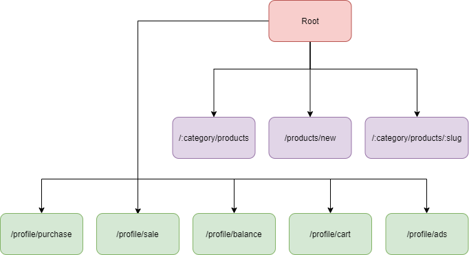
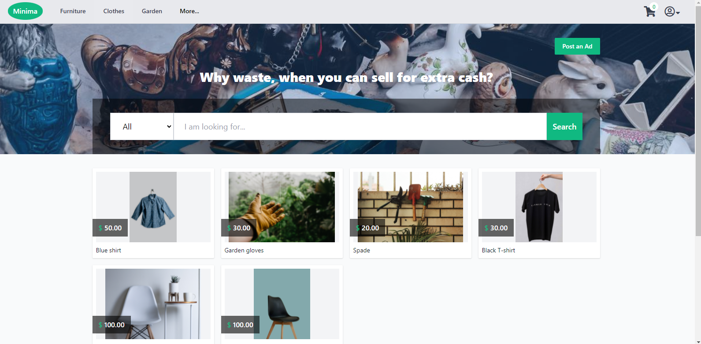
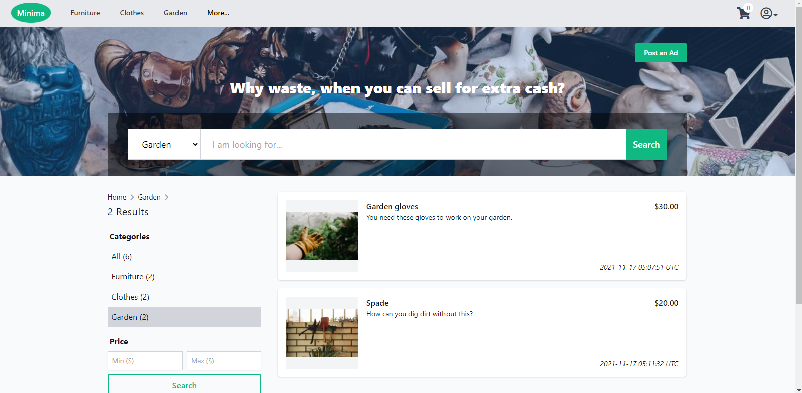
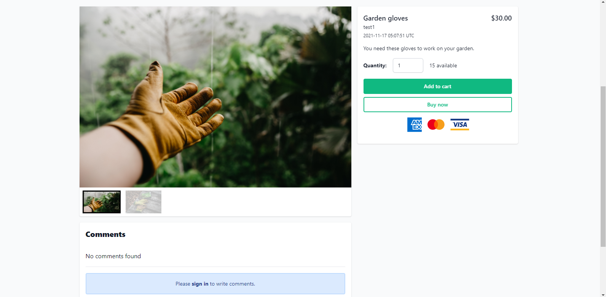
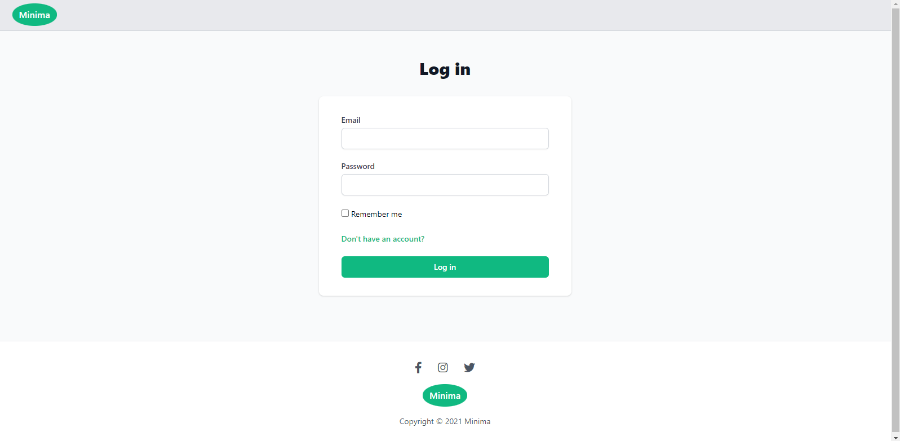
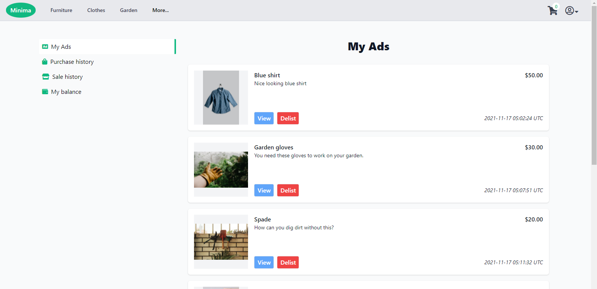
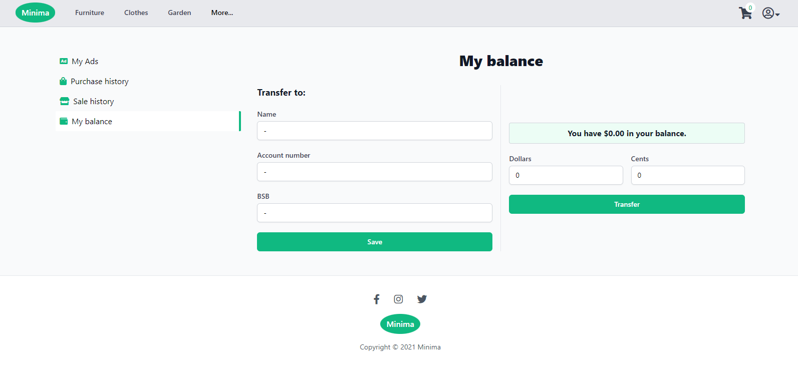
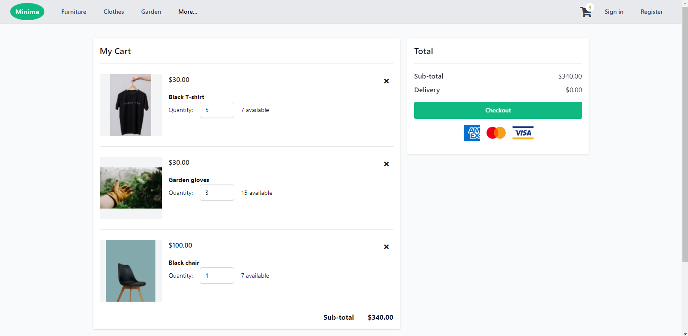
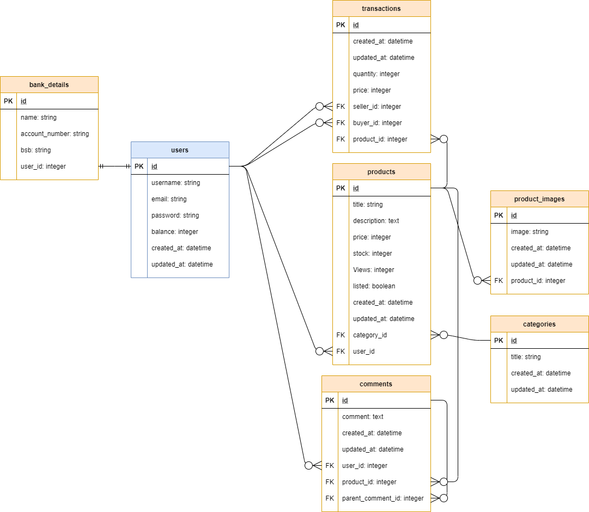

# JihyungKim_T1A2

## Quick Summary

- Live website: https://minima-marketplace.herokuapp.com/
- Github repository: https://github.com/jkim333/T2A2-Marketplace-Project

<br/>

## Purpose

The purpose of this app is to allow users to buy or sell second-hand products online. This app helps to reduce waste by allowing sellers to sell items that are no longer needed by them and buyers to acquire these products instead of buying new items unnecessarily.

<br/>

## Getting started

To get started with the app, clone the repo and then install the needed gems:

```
$ bundle install
```

Migrate the database:

```
$ rails db:migrate
```

Next, run the seed file:

```
$ rails db:seed
```

Run the app in a local server:

```
$ rails server
```

<br/>

### **Functionality / features**

The following is a list of key features used:

- Login/registration
- View products and individual product
- Post a new advertisement
- Searching and filtering of products
- Comments and replies
- Add products to cart
- Admin dashboard to delist/relist advertisement, and view transaction histories

<br/>

### **Sitemap**



<br/>

### **Screenshots**









<br/>

### **Tech stack**

The following is a list of technologies used:

- Ruby
- Ruby on Rails
- HTML
- CSS
- Tailwind CSS
- JavaScript
- AWS S3
- Heroku

<br/>

## Wireframes

### **Home page**


<br/>

### **Products page**


<br/>

### **Individual product page**


<br/>

### **Sign in page**


<br/>

### **Registration page**


<br/>

### **My balance page**


<br/>

### **Post an Ad page**


<br/>

## Entity Relationship Diagram

At the centre of the diagram is the User model. The User model has a one to one relationship with the BankDetail model. BankDetail model allows a user to store their bank detail and is used to transfer the user's profit to their bank account.

The User model has a one to many relationship with the Product model, as a user can have zero or many different products for sale. The product model has a one to many relationship with the ProductImage model as a product can have zero or many different images linked to the product. The Product model has a many to one relationship with the Category model as a product needs to belong to a particular category.

The Product model has a one to many relationship with the Comment model as a product can have zero or more comments. The comment model has a many to one relationship with the User model as a comment must belong to a particular user. Morever, the comment model has a self-referential relationship to allow a comment to be created as a child of another comment.

The Transaction model has many to one relationships with the User and the Product models. Each time a buyer purchases a product from a seller, a transaction record is created that holds information about the purchase details, who the buyer was, who the seller was, and what the product was.



<br/>

## Third party services

The third party services used are:

- **Heroku**, which is a Platform as a Service provider that allows developers to deploy their applications to the cloud. Developers can deploy their app at ease and with minimal effort to Heroku as a lot of manual configurations are carried out by Heroku automatically.
- **Amazon Web Services Simple Storage Service (S3)**, which is a type of cloud services provided by Amazon Web Services that allows storage of files as objects. S3 is highly scalable, meaning that there is no limit as to the amount of data it can store. S3 is used to store user uploaded images for this app as S3 is much cheaper and reliable than storing the data in Heroku.
