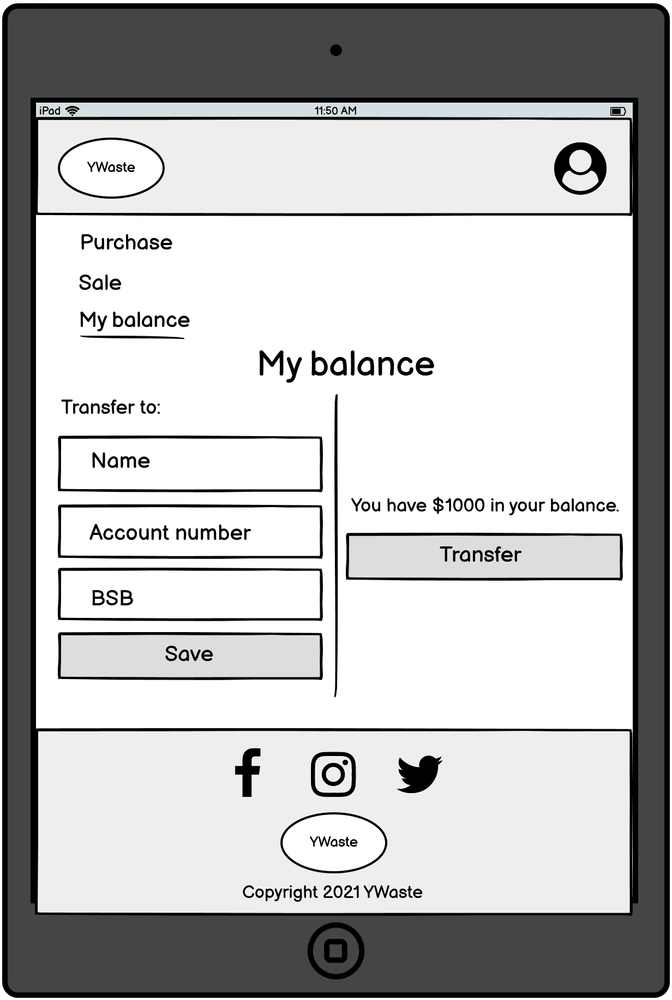

# JihyungKim_T2A2

## Quick Summary

- Live website: https://minima-marketplace.herokuapp.com/
- Github repository: https://github.com/jkim333/T2A2-Marketplace-Project

 

## Problem

Items that are no longer needed are typically just thrown out and they end up in the waste. Waste is not good for the environment, especially when these items could still be used by others instead of ending up in the waste.

Instead of letting these items go to the waste, this app allows people to sell their products to other buyers. That way, a seller can make money through the transaction, and a buyer can acquire the product they need. All in all, this app prevents items going to the waste from the seller's perspective, and prevents unnecessary purchase of new items from the buyer's perspective, leading to the reduction in the impact to the environment.

 

## Description

### **Purpose**

The purpose of this app is to allow users to buy or sell second-hand products online. This app helps to reduce waste by allowing sellers to sell items that are no longer needed by them and buyers to acquire these items second hand instead of buying them new unnecessarily.

 

### **Functionality / features**

The following is a list of key features used:

- Login/registration
- View products and individual product
- Post a new advertisement
- Searching and filtering of products
- Comments and replies
- Add products to cart
- Admin dashboard to delist/relist advertisement, and view transaction histories

 

### **Sitemap**

 

### **Screenshots**

 

### **Target audience**

The target audience is anyone that wants to sell their products to others and make money instead of throwing their products out to the waste.

 

### **Tech stack**

The following is a list of technologies used:

- Ruby
- Ruby on Rails
- HTML
- CSS
- Tailwind CSS
- JavaScript
- AWS S3
- Heroku

 

## User stories

Below is a link to the trello dashboard:
https://trello.com/b/DyRHwLAI/t2a2

Tasks are allocated into the "To Do", "Doing" and "Done" columns. Tasks that need to start are first allocated into the "To Do" column. When I start working on the task, I would move the task to the "Doing" column. After completing the task and committing the changes in git, I would then move that task to the "Done" column to signal that the task is completed.

 

## Wireframes

### **Home page**

 

### **Products page**

 

### **Individual product page**

 

### **Sign in page**

 

### **Registration page**

 

### **My balance page**

 

### **Post an Ad page**

 

## Entity Relationship Diagram

At the centre of the diagram is the User model. The User model has a one to one relationship with the BankDetail model. BankDetail model allows a user to store their bank detail and is used to transfer the user's profit to their bank account.

The User model has a one to many relationship with the Product model, as a user can have zero or many different products for sale. The product model has a one to many relationship with the ProductImage model as a product can have zero or many different images linked to the product. The Product model has a many to one relationship with the Category model as a product needs to belong to a particular category.

The Product model has a one to many relationship with the Comment model as a product can have zero or more comments. The comment model has a many to one relationship with the User model as a comment must belong to a particular user. Morever, the comment model has a self-referential relationship to allow a comment to be created as a child of another comment.

The Transaction model has many to one relationships with the User and the Product models. Each time a buyer purchases a product from a seller, a transaction record is created that holds information about the purchase details, who the buyer was, who the seller was, and what the product was.

 

## High-level components

Rails uses the Model View Controller (MVC) architecture. This architecture allows rails to have clean separation of concerns.

For example, when a request is made by the user to access the root page, it is first sent to the router. The router then processes the request and determines which controller action to forward the request to. Since the user wants to access the root page, it will forward the request to the 'home' action of the 'static_pages' controller.

The 'home' action makes a request to the database to extract the categories model instances and products model instances via the model. The action then forwards these model instances to the view.

The view uses the model instances to dynamically develop a HTML response. The categories model instances are used to form the different categories buttons available in the navbar. THe products model instances are used to display the available products on the root page. The view then forwards the HTML response back to the user to allow the user to view and interact with the root page.

 

## Third party services

The third party services used are:

- **Heroku**, which is a Platform as a Service provider that allows developers to deploy their applications to the cloud. Developers can deploy their app at ease and with minimal effort to Heroku as a lot of manual configurations are carried out by Heroku automatically.
- **Amazon Web Services Simple Storage Service (S3)**, which is a type of cloud services provided by Amazon Web Services that allows storage of files as objects. S3 is highly scalable, meaning that there is no limit as to the amount of data it can store. S3 is used to store user uploaded images for this app as S3 is much cheaper and reliable than storing the data in Heroku.
